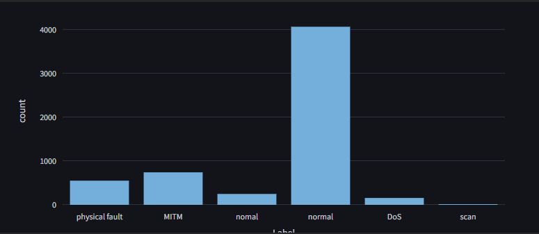

# Report Data Protection – Project
## Introduction
The goal of this project is to use data from the physical and network datasets to predict the state of the system, it can either be 'normal' or under attack the types of attacks are:

- MITM (Man-in-the-middle)
- Physical fault
- DoS (Denial of Service)
- scan
The dataset is divided into 2 parts :
- Physical dataset : it contains 2 hours of 1 measurement per second data of sensors such as pressure, flow rate, and states of valves.
- Network dataset

We try to predict the state of the system using the physical dataset and the network dataset separately. We can 
already assume that the scanning attacks won't be correctly predicted using the physical dataset because they 
only affect the network data.

## Physical dataset
### Data preprocessing
We have 4 files for the physical dataset :
- phy_att_1,2 and 3 are tab separated csv files that contain each 30 minutes of data where attacks occurred.
- phy_att_4.csv is comma separated csv file that contains 30 minutes of data where attacks occurred.
- phy_normal.csv is tab separated csv file that contains 1 hour of normal data.

For our analysis we merged the 5 files into a single dataframe, this was not straightforward because some columns were not matching.

The files have slightly different column structures. While the first file only contains a "Label" column, files 2 and 3 include an additional binary indicator column "Label_n" (with some spelling variations like "Lable_n"). This indicator column uses a value of 1 to denote when the corresponding "Label" value represents an attack state, and 0 for normal operation.

proof :
```py
df1[(df1["Label_n"] == 1) & (df1["Label"] == "normal")]
>>> 0 rows × 43 columns
```

**What do we do ?** We remove the `label_n` and `lable_n` columns to merge the datasets correctly (42 columns) then we add a new column "Label_n" that will be 0 for normal and 1 for attack.

We also noticed an anormal attack name : "nomal". It is not an attack but a normal state (likely a typo), we replace it by "normal" for the whole dataframe.


We notice that some columns have only one unique value, this will not help our model to predict the state of the system so we drop them.

```py
print(df.nunique()[df.nunique() == 1])
>>>     Pump_3           1
        Flow_sensor_3    1
        Valv_1           1
        Valv_2           1
        Valv_3           1
        Valv_4           1
        Valv_5           1
        Valv_6           1
        Valv_7           1
        Valv_8           1
        Valv_9           1
        Valv_16          1
        Valv_19          1
        Valv_21          1
```

We shuffle the dataframe to avoid any bias and drop the "Time" column because it is not relevant for our analysis. Indeed predicting the time of the attack is not the goal of this project.

### Model training
> [!IMPORTANT]  
We drop the Label_n and Label columns from the test dataset

We have a choice to make : predicting the state of the system (normal or attack) or predicting the type of attack (MITM, DoS, Physical fault, Scan). 


Let's start by predicting the state of the system. We will have a smaller imbalance between the classes which will make the training easier.

#### Predicting the state of the system

We use the same training and testing conditions for each model according to the research paper : **5-fold cross validation**

We run the same models that they used with the same hyperparameters.

- K-Nearest Neighbors (KNN) with k=10
- Random Forest with 100 trees
- Support Vector Machine (SVM) with RBF kernel
- Naive Bayes

We use the macro average of the metrics to compare the models. Indeed using the weighted average would show good metrics even if the model is not very good at predicting the class with the least samples (attack in this case).

> [!CAUTION]  
It is not said in the paper what type of average is used (weighted avg or macro avg)and what column is being predicted (Label or Label_n).

Our training results :

| Model | Accuracy | Recall | Precision | F1-Score |
|-------|----------|-----------|-----------|---------|
| KNN           | 0.96 | 0.95 | 0.96 | 0.95 |
| Random Forest | 0.98 | 0.98 | 0.98 | 0.98 |
| SVM           | 0.79 | 0.64 | 0.88 | 0.66 |
| Naive Bayes   | 0.68 | 0.61 | 0.61 | 0.61 |
||||

For comparison the paper had these results (we do not know what type of average they used) :
| Model | Accuracy | Recall | Precision | F1-Score |
|-------|----------|---------|-----------|----------|
| KNN | 0.98 | 0.95 | 0.95 | 0.95 |
| Random Forest | 0.99 | 0.98 | 0.95 | 0.97 |
| SVM | 0.93 | 0.92 | 0.64 | 0.75 |
| Naive Bayes | 0.93 | 0.92 | 0.66 | 0.77 |

We observe pretty similar results, the Random Forest and KNN have the best accuracy and F1-score while the SVM and Naive Bayes have the worst precision and recall. 

We also train some more modern models like XGBoost and CatBoost :
| Model | Accuracy | Recall | Precision | F1-Score |
|-------|----------|---------|-----------|----------|
| MLP           | 0.82 | 0.78 | 0.81 | 0.78 |
| XGBoost       | 0.98 | 0.98 | 0.98 | 0.98 |
| CatBoost      | 0.98 | 0.98 | 0.98 | 0.98 |

They provide very good results, catboost is slightly better than XGBoost but is also slower to train (20s vs 1.5s).

#### Predicting the type of attack
.png>)
We have 4 types of attacks in the dataset :
- MITM
- DoS
- Physical fault
- Scan

###### With the scan class

Let's see how our models perform on this task :

macro avg for recall, precision and f1-score :
| Model | Accuracy | Recall | Precision | F1-Score |
|-------|----------|---------|-----------|----------|
| KNN           | 0.96 | 0.76 | 0.74 | 0.75 |
| Random Forest | 0.99 | 0.77 | 0.79 | 0.78 |
| SVM           | 0.82 | 0.33 | 0.56 | 0.38 |
| Naive Bayes   | 0.23 | 0.47 | 0.31 | 0.22 |
<!-- | CART          | 0.97 | 0.76 | 0.76 | 0.76 | -->
<!-- | CatBoost      | 0.99 | 0.78 | 0.78 | 0.78 | -->

We notice very disapointing results for the recall precision and f1-score

Let's dig into the results :
```py
{'DoS': {'f1-score': 0.9230769230769231,
         'precision': 0.8571428571428571,
         'recall': 1.0,
         'support': 30.0},
 'MITM': {'f1-score': 0.9114754098360656,
          'precision': 0.879746835443038,
          'recall': 0.9455782312925171,
          'support': 147.0},
 'accuracy': 0.9610726643598616,
 'normal': {'f1-score': 0.9738717339667459,
            'precision': 0.9750297265160524,
            'recall': 0.9727164887307236,
            'support': 843.0},
 'physical fault': {'f1-score': 0.9494163424124513,
                    'precision': 1.0,
                    'recall': 0.9037037037037037,
                    'support': 135.0},
 'scan': {'f1-score': 0.0, 'precision': 0.0, 'recall': 0.0, 'support': 1.0},
 'macro avg': {'f1-score': 0.7515680818584372,
               'precision': 0.7423838838203894,
               'recall': 0.7643996847453888,
               'support': 1156.0},
 'weighted avg': {'f1-score': 0.9609206495656203,
                  'precision': 0.9619265830254711,
                  'recall': 0.9610726643598616,
                  'support': 1156.0}}
```
The macro average is getting very impacted by the lack of any good prediction on the `scan` class. Indeed the f1-score, precision and recall are all 0 for this class.

The macro avg is being calculated by taking the average of the f1-score, precision and recall of each class, **without** taking into account the support of each class.

We could use weighted average but this would give too much importance to the `normal` class which has the most samples.

Thus we decided to remove the `scan` class from the dataset. This makes even more sense because predicting the scan attack is said to be impossible without network data.


###### Without the scan class
Here is our new distribution of the classes :

.png>)

We run our models again and get these better results :D

| Model         | Accuracy | Precision | Recall | F1-Score |
|---------------|----------|-----------|---------|----------|
| KNN           | 0.97     | 0.95      | 0.93    | 0.94     |
| Random Forest | 0.99     | 0.97      | 0.98    | 0.98     |
| SVM           | 0.82     | 0.42      | 0.70    | 0.47     |
| Naive Bayes   | 0.29     | 0.52      | 0.37    | 0.30     |
| CART          | 0.97     | 0.96      | 0.96    | 0.96     |
| CatBoost      | 0.99     | 0.97      | 0.98    | 0.98     |

CatBoost provides the best results with an accuracy of 99% and a f1-score of 0.98.
Here is the confusion matrix of the CatBoost model :

.png>)


## Network dataset
### Data preprocessing
We have 5 files for the network dataset :
- attack_1.csv, attack_2.csv, attack_3.csv, attack_4.csv. Each contains 30 minutes of network data where attacks occurred.
- network_normal.csv contains 1 hour of normal network data.

The network data is collected at the same time as the physical datas so we can match each network data with the corresponding physical data.

Once again we merge the 5 files into a single dataframe. But first let's ensure that the columns match.

```py
df1.columns
>>> ['Time', ' mac_s', ' mac_d', ' ip_s', ' ip_d', ' sport', ' dport', ' proto', ' flags', ' size', ' modbus_fn', ' n_pkt_src', ' n_pkt_dst', ' modbus_response', ' label_n', ' label']

df4.columns
>>> ['Time', 'mac_s', 'mac_d', 'ip_s', 'ip_d', 'sport', 'dport', 'proto', 'flags', 'size', 'modbus_fn', 'n_pkt_src', 'n_pkt_dst', 'modbus_response', 'label_n', 'label']
```

We notice a leading space in the columns of all dfs except the normal one. We remove it from all dfs using the `str.strip()` method :

```py
df_list = [df1_nul, df2_nul, df3_nul, df4_nul]
for i, df in enumerate(df_list):
    df_list[i] = df.rename(mapping={col: col.strip() for col in df.columns})
df1, df2, df3, df4 = df_list
```

And now we continue to merge the 5 CSV datafiles as we did in the physical data 

We shuffle the dataframe to avoid any bias and drop the "Time" column because it is not relevant for our analysis as we did in the physical data.

and also we found out that sport and proto have only one unique value so we drop them.
```py
print(df.nunique()[df.nunique() == 1])
>>> sport    1
    proto    1
```

and here is the distribution of the classes :


We notice that the network data has a lot more samples than the physical data and that the classes are more imbalanced so we decide to use undersampling and drop 70% of the normal label rows.

Also we will drop scan because it is not an attack.


Let's start by predicting the state of the system (attack or normal). We will have no imbalance between the classes which will make the training easier. And to first test the models on a fraction of the data because the original one have more than 20 million rows.

### Model training


We dropped Rows with Missing Values to Ensure the dataset is clean for more precise results as we could afford to drop these rows without significant loss.


We Used Label Encoding to convert categorical MAC addresses(mac_s, mac_d) into numeric values.

We converted IPs to integers by removing dots (.) and treating the result as a single integer.

We applied to proto (protocol) and modbus_fn (Modbus function) using one-hot encoding.


#### Predicting the state of the system


We run the same models that they used with the same hyperparameters as in the physical dataset.

- K-Nearest Neighbors (KNN) with k=10
- CART
- Random Forest with 100 trees
- CatBoost
- Naive Bayes
